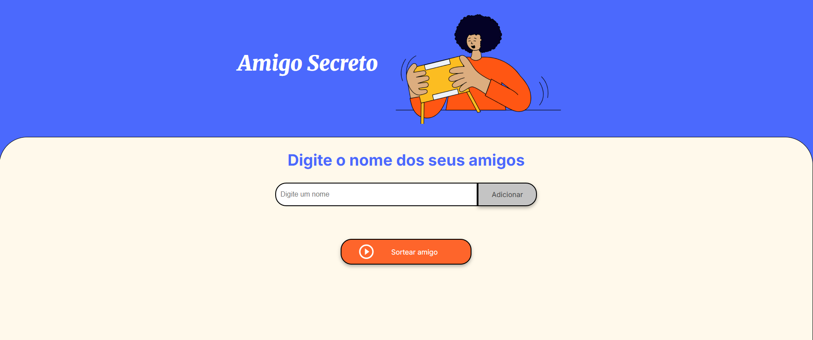

# Sorteador de Amigo Secreto

Um aplicativo web simples para realizar sorteios de amigo secreto de forma rápida e fácil.



## Sobre o Projeto

O Sorteador de Amigo Secreto é uma aplicação web simples e intuitiva que permite aos usuários adicionar nomes de pessoas e sortear aleatoriamente um nome da lista..

## Funcionalidades

- Interface intuitiva e responsiva
- Adicionar múltiplos nomes à lista de participantes
- Executar sorteio aleatório entre os participantes
- Limpar automaticamente a lista após cada sorteio
- Validação para evitar entradas em branco

## Tecnologias Utilizadas

- HTML5
- CSS3
- JavaScript (Vanilla)
- Fonte: Inter e Merriweather (Google Fonts)

## Como Usar

1. Acesse a aplicação através do seu navegador
2. Digite o nome de um participante no campo de texto
3. Clique no botão "Adicionar" ou pressione Enter para incluir o nome na lista
4. Repita os passos 2 e 3 para adicionar todos os participantes
5. Quando estiver pronto, clique no botão "Sortear amigo"
6. O nome sorteado será exibido na tela
7. A lista será limpa automaticamente após o sorteio, permitindo iniciar um novo sorteio

## Estrutura do Projeto

```
amigo-secreto/
│
├── index.html         # Estrutura HTML da aplicação
├── style.css          # Estilos CSS da aplicação
├── app.js             # Lógica JavaScript do sorteador
│
└── assets/            # Diretório de recursos
    ├── amigo-secreto.png       # Imagem de banner
    └── play_circle_outline.png # Ícone do botão de sorteio
    └── page.png                # Printscreen do projeto
```

